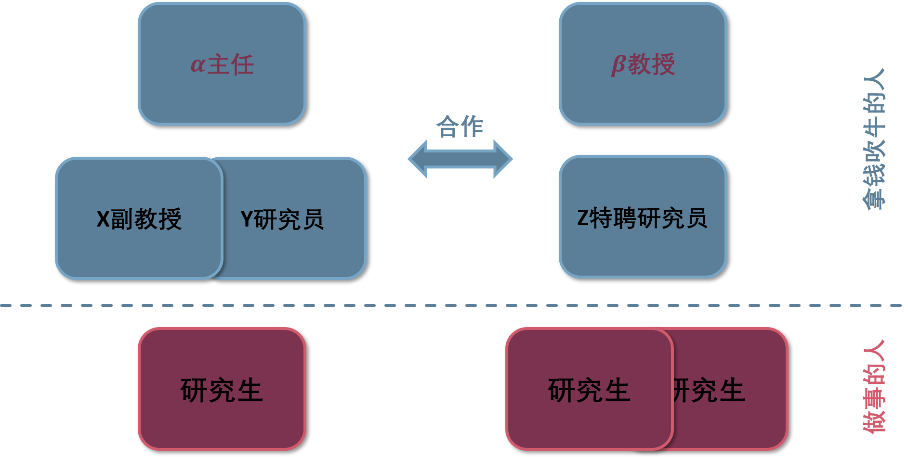
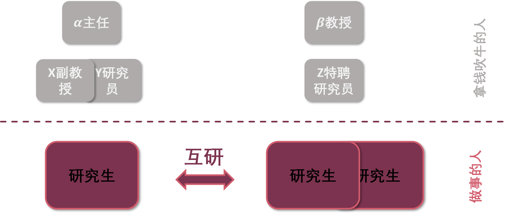

# ——让科研合作更便利

## Abstract

HuYan is proposed to make the cooperation in academia transparent and fast with an online platform which allow a direct inter-researcher communication.

## Introduction and Background

>中国学术圈现在有两个大问题亟待解决：1.掌握大量学术资源的大佬很多早就不做学问，成为了学术掮客，忽悠经费，搞关系，垄断学术评审话语权。2.劣币驱除良币，一些蹭热点，学术大佬的投机型学者发表大量论文，以此在国家级人才项目的评审中把一些踏踏实实做学问的人干翻在地。\[1\]

这两个问题带来了科研合作的两个困难，请回忆身边的科研合作项目，它们大多如下图所示：

其中最大的困难是：“大佬”们已经若干年不在一线科研，对于实际问题的难度，方案的可行性没有很好的把握。对学生的指导浮于表面，难以起到真正的指导作用。
其次：“大佬”上面还有“大佬”，层层叠叠，关系复杂，而项目合作双方的学生反而难以得到足够的交流，这种现象在需要学科交叉时尤为严重。

互研的建立就是希望能减少这两个问题带来的影响。

## Method

建立一个网站，直接推进学生与学生之间的合作。

1. 高年级的科研无产阶级可以直接帮助低年级的科研无产阶级，点名哪个方向是坑，哪个方法可行。

2. 不同学科的科研无产阶级互相帮助，推进学生和学生的合作。

互研希望搭建的模式如下图所示：

## Experiments and Results

未完待续。

## Reference
1. [如何看待中南大学 92 年特聘教授齐冲冲，3 年博士期间发表 40 篇 SCI？ - feby的回答 - 知乎](https://www.zhihu.com/question/356327912/answer/901495669) 代彬
